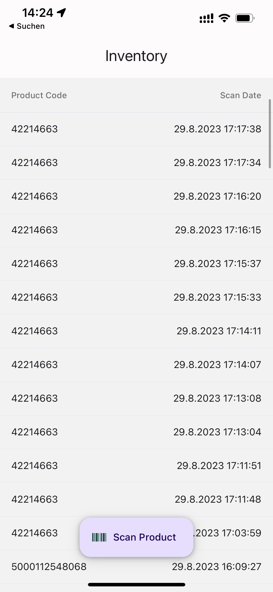
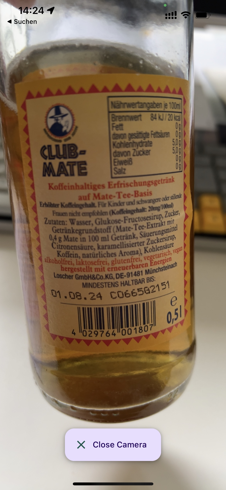

# Coding Challenge (original task below)
This repository contains the solution to the INV-1 task of the Coding Challenge.

## Implementation
My implementation of choice is:
- React Native: Expo, TypeScript, React Native Paper and Redux.

## Demo

  

## Screenshots

### iOS (iPhone 11)
 
 

### Android (Pixel 7)
 

# Coding Challenge

Inventory is a small utility app that could be used in a logistics company. It has two use cases:

1. Adding products to the inventory using a bar code scanner
2. Viewing the inventory of products

Screenshots:

This repository contains two implementations of the app:

- React Native: Expo, TypeScript, React Native Paper and Redux.
- Ionic: Capacitor, Redux, Phonegap Plugin Barcode Scanner.

The backend is a REST API provided by Airtable.

## Tasks

Project management has created tasks related to the app and put them on the Kanban board. Pick an implementation and try to solve the task assigned to you within a reasonable amount of time (~2h).

## Submission

Please upload your submission to a public GitHub or GitLab repository, and share the link with us.

---

### INV-1

**Type:** Feature

**Subject:** Product list redesign

**Description:** The representation of the home screen's product list has been reworked to provide a more engaging user experience (link to inspectable design prototype below). Create a `ProductItem` component that implements the new design.

- Show name (truncated to 1 line)
- Show date
- If date is within last 7 days, show a "New" icon
- Show image
- If image is missing, show a placeholder
- Show categories as individual "Tags"
- Products are displayed in a collapsed state by default but can be expanded to see more details by clicking the arrow button
- Bonus/Animations: Animate the expanding/collapsing of products using a simple easing curve
- Bonus/Performance: Optimize the product list for performance, ensuring smooth scrolling even with a large number of products. Implement virtualization techniques to handle potentially infinite lists.

**Tipp:**
All required product data is already provided by the inventory state. To fully access the design prototype you will need a Figma account. Use the design prototype to inspect design specifications as well as to export any image assets that are required. Pay attention to the exact dimensions, font sizes, colors etc used in the design prototype. The accuracy of the implementation will be reviewed using iOS and Android devices.

**Links:**
https://www.figma.com/file/K8J4g5y1QnYZonwgFisvXK/Coding-Challenge?node-id=0%3A1

---

### INV-2

**Type:** Bug

**Subject:** Inventory list limited to 100 items

**Description:** On the app's home screen the user cannot scroll beyond 100 items. The list of products stops after 100 items, despite more items being stored in the backend. The app should load remaining items when the user scrolls to the end of the list.

**Tipp:**
Airtable's REST API allows for 100 items to be fetched in one request. If there are more items, the response will contain an offset. To fetch the next page of items, include offset in the next request's parameters. Create a `fetchMoreInventory` thunk action that enables pagination using the `offset` parameter.

---

## Additional info

- The goal is not to have a perfect solution but to be able to perfectly explain whatever result you have got.
- For questions regarding the instructions don't hesitate to get back in contact with us.
